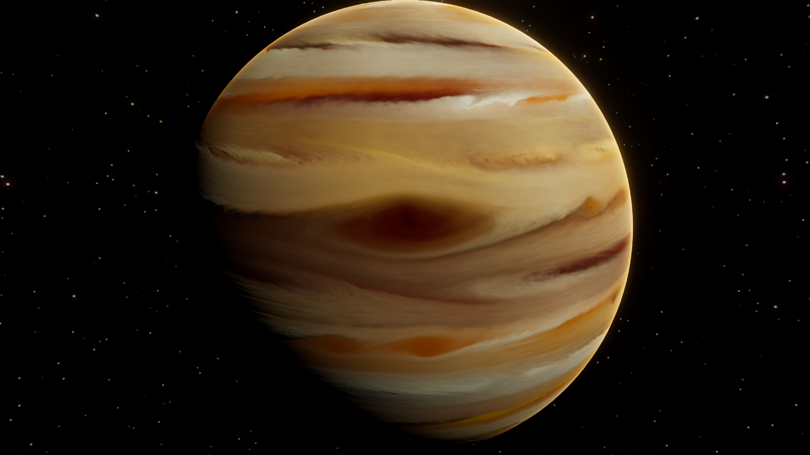
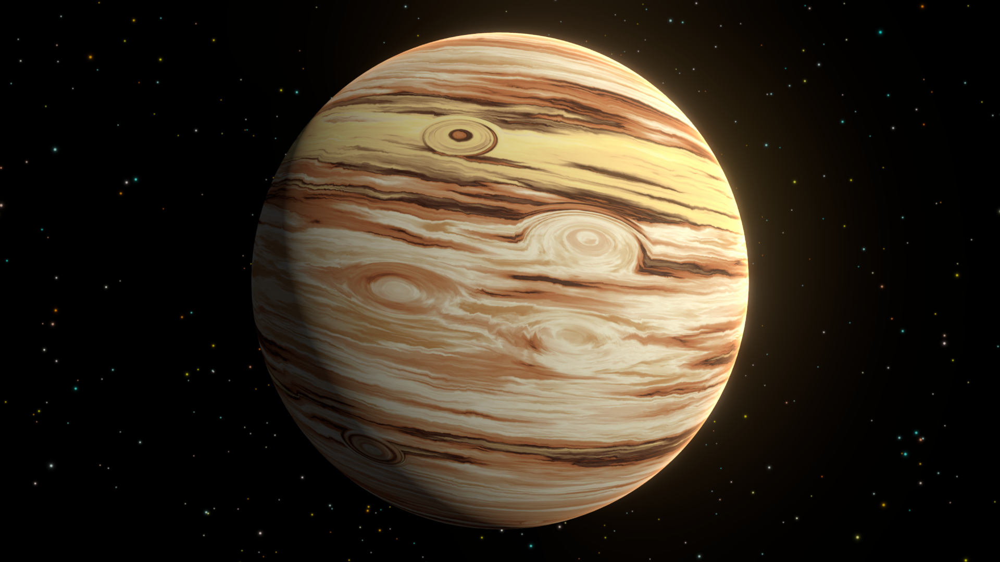
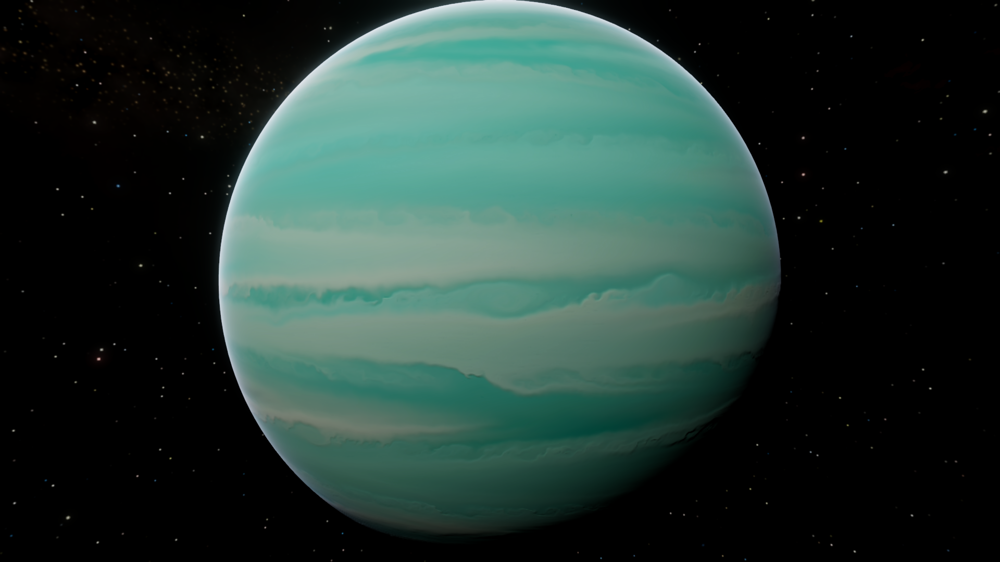
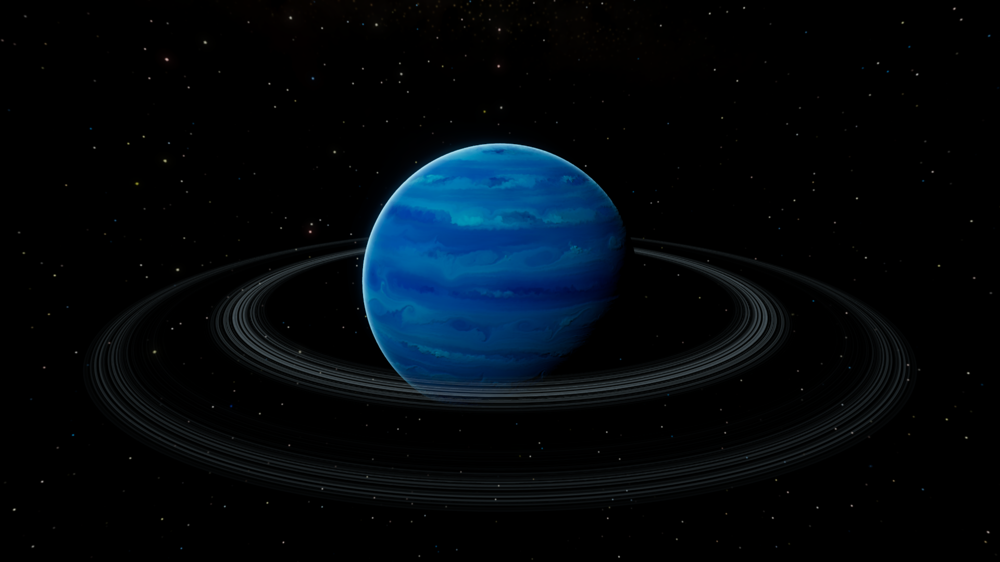
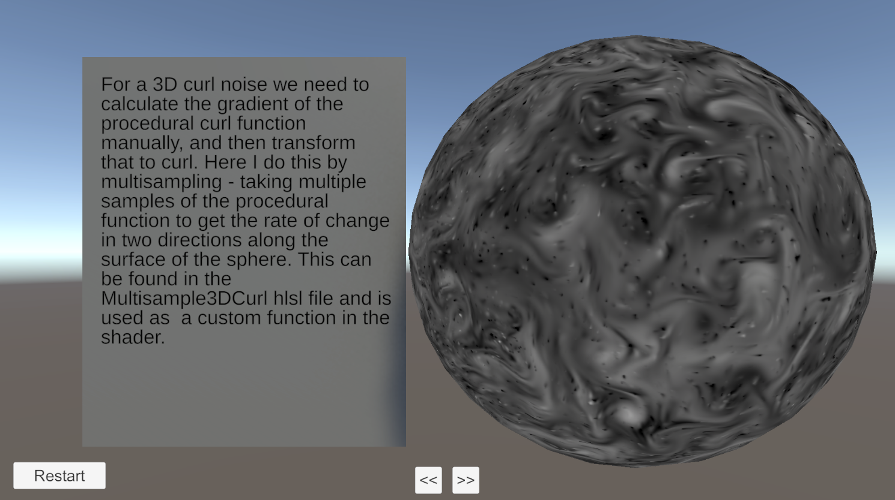

---
publishDate: 2026-02-24
title: 'Gas Giant Curl Simulation in Unity'
excerpt: Custom Render Textures for shader simulation of curl flow. Procedural 3D curl generation. GitHub tutorial project.
image: '~/assets/images/blog/gas-giant-curl-simulation/gas-giant-curl-cover.png'
tags:
  - unity
  - procedural-generation
  - custom-render-texture
  - simulation
metadata:
  canonical: https://parallelcascades.com/gas-giant-curl-simulation
---

# Curl Simulation Gas Giants

I've just released the 1.2.0 version of Procedural Planet Generation, which includes
a new technique for simulating gas giants with curl noise:

## The old procedural gas giants

Before curl noise, I was making gas giants with procedural shaders with noise and banding
functions to approximate the flowing surfaces of gas giants. Some early iterations looked like this:

These used domain warped noise to natural-looking flowing patterns. I then stretched it out in the y direction and squished in the x and z direction to
create the appearance of bands.

More advanced features like oval and swirling storms were added on top to layer detail:

Finally, with more explicit banding functions and blending multiple noise types together I could get something like this:

Still ugly. And each detail layer requires procedural noise and ramps up the performance
cost. Animating it never looks quite right. At best, you get a 'stylized' gas giant. The performance issues
you can alleviate by baking the procedural texture.

Instead of trying to approximate the appearance of a gas giant with procedural functions, we can try to actually
simulate flow on the surface of a sphere. We will still use a shader to create the flow pattern - storms and vertical bands.
But we will use a technique where we use a texture whose colors will represent our gas giant 'particles'. And by
reading and writing from that same texture each frame, we will be storing its updated colors, which represent the updated 
particle position, thus creating persistent animated flow over time.

The technique is known as 'curl noise', and it can be implemented in Unity with Custom Render Textures
and Shader Graph. The results:

Emil Dziewanowski's flowfields [article](https://emildziewanowski.com/flowfields/) goes into great detail how to procedurally generate curl and build complex simulations,
but it's in Unreal Engine. So I had to adapt it to Unity and Shader Graph.

And also he uses it on a flat plane, whereas I want to use it on a sphere, so Jan Wedekind's [article](https://www.wedesoft.de/software/2023/03/20/procedural-global-cloud-cover/)
was helpful for the math necessary to get 3D curl.

So I've built a demo project in Unity. Check it out on GitHub:

https://github.com/Parallel-Cascades/curl-flow-simulation

