# Procedural Planet Shaders and Texture Baking

There are many different approaches to procedural planet generation: mesh-based deformation, volumetric raymarching, advanced mesh
partitioning techniques for LOD and landable planets. For the game I'm working on, I chose a **shader-based** approach. 
I don't require landable planets, and it's straightforward to build and reason about using Unity's default tools.

**Procedural shaders** also provide infinite (albeit similar) variations and instant real-time customization, and they
don't take up disk space like large 4K textures. But they come with a **high cost** on **GPU performance**. On modern GPUs this is
manageable, you still get good framerates without perfectly optimized shaders. But it's still wasteful to recalculate
the surfaces of static planets every frame, and very complex shaders can still impact performance significantly.

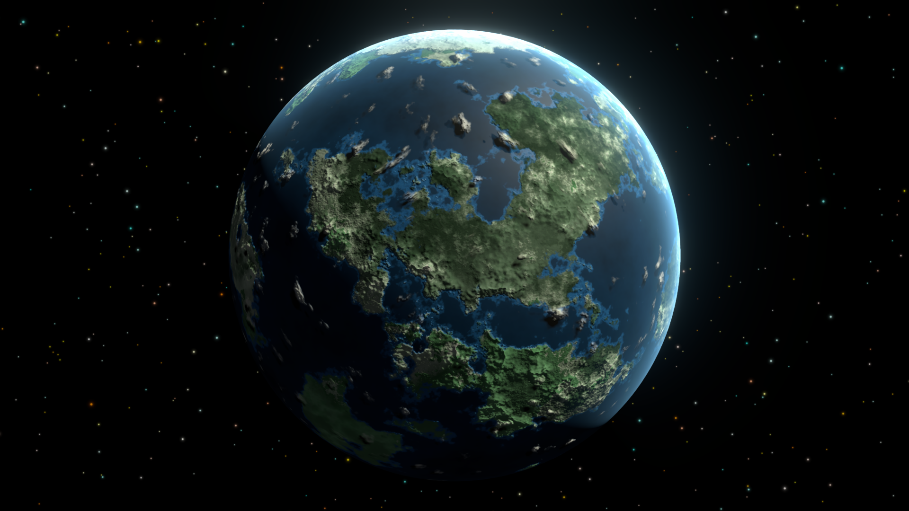
<figure style="text-align: center;">
  <figcaption style="font-size: 0.9em; color: #666; margin-top: 0.5em;">A procedural planet shader with multiple shader functions: continents and oceans, ice caps, heightmap detail, clouds and smoothness, atmospheric glow.</figcaption>
</figure>

Traditional workflows may have you design materials in **Blender**, then bake their outputs to textures for importing in
Unity. That works, but switching between tools costs time, and what Blender's lighting settings and exported textures 
don't always remain consistent when importing in Unity. **Baking inside Unity** lets you see your planets accurately
in-engine immediately. Later we can even set up runtime procedural baking to generate planets entirely in-game.

In the first part of this tutorial series, we'll set up **equirectangular texture baking** for a simple Earth-like planet shader. 

# Tutorial

## Project Setup

To get started, I've provided you with a Unity project that has the foundation for building a procedural
texture baking utility. It's built with Unity 6000.0.64f1 and the Universal Render Pipeline (URP). This includes a simple
Earth-like planet shader in a blank scene that we will modify to add texture baking functionality.

You can clone the project from [this](https://github.com/Parallel-Cascades/planet-texture-baking
) Github repository, or download the *.unitypackage* from the Releases section and import it into
your own project. If you're not interested in the tutorial, you can also get the completed project from the same repository.

For the full advanced procedural planets system, check out the [Procedural Planet Generation](https://assetstore.unity.com/packages/vfx/shaders/procedural-planet-generation-339842) asset on the Unity Asset Store.

## Starter Scene
Open the provided sample scene to get started:

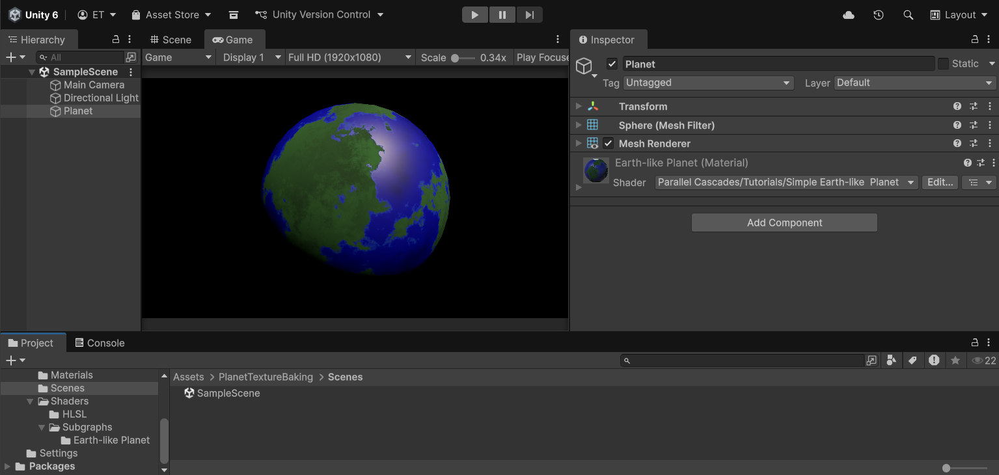

## Planet Shader

The planet shader is built with Shader Graph. Among other benefits, I prefer making shaders with Shader Graph because 
the visual node previews enable quick debugging and experimentation.

If you're unfamiliar with Shader Graph, check the official Unity [documentation](https://docs.unity3d.com/Packages/com.unity.shadergraph@17.5/manual/Getting-Started.html).

We will edit this shader to add texture baking functionality. Open the **Simple Earth-like Planet** Shader Graph.

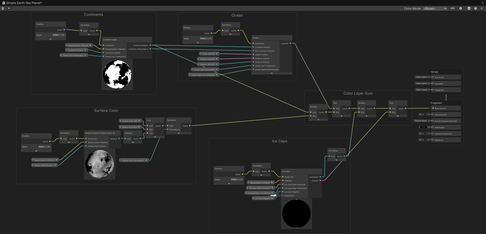

You can see the different layers that make up the planet surface: continents, oceans, ice caps, and surface color. This 
is a very simplified version of a planet shader that will allow us to focus on the texture baking process.

### Shader Performance

We need to measure the baseline performance before baking, to see what improvement we will bring later.
Testing on a GTX 3060, we set the game view to **4K resolution** to have the largest performance impact:

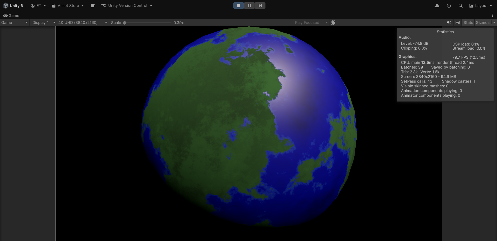

So we get around 80 FPS, or about 12 ms per frame, when a simple static planet fills the screen.

This is before adding more complex detail to the planet. Heightmap mountains require another layer of noise. If we want
to have procedural normals, we will need to apply smoothing through taking multiple samples for the noise functions per
each pixel. All this adds up quickly.

Replacing these procedural noise calculations with a texture sample will improve performance significantly. This tutorial
will show how to set up the texture baking for the surface color and then sample it as a texture.
The same approach works for heightmaps, smoothness, metallic, emission maps, etc.

## Texture baking

### Baking Outline
The texture baking technique inside Unity is the following:

We will apply our planet material to a temporary flat quad in front of an orthographic camera so that it fills the camera view.
Then we use a render texture to capture that camera output, read back the pixels into a Texture2D, and save that to disk as a PNG file.

### Flat Quad UV Mapping
If we place our material on a quad, we get this stretched out and distorted texture:

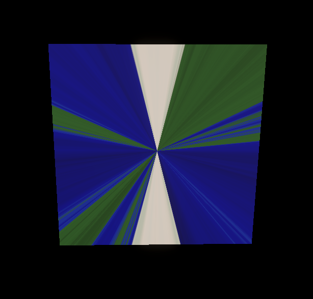

In the planet shader, our noise functions receive the 3D **Object Position** of each point on the sphere's surface. 
But the flat quad only has 2D position.

So we will need to figure out the mappings between the quad's 2D UV coordinates and the 3D positions on the sphere.

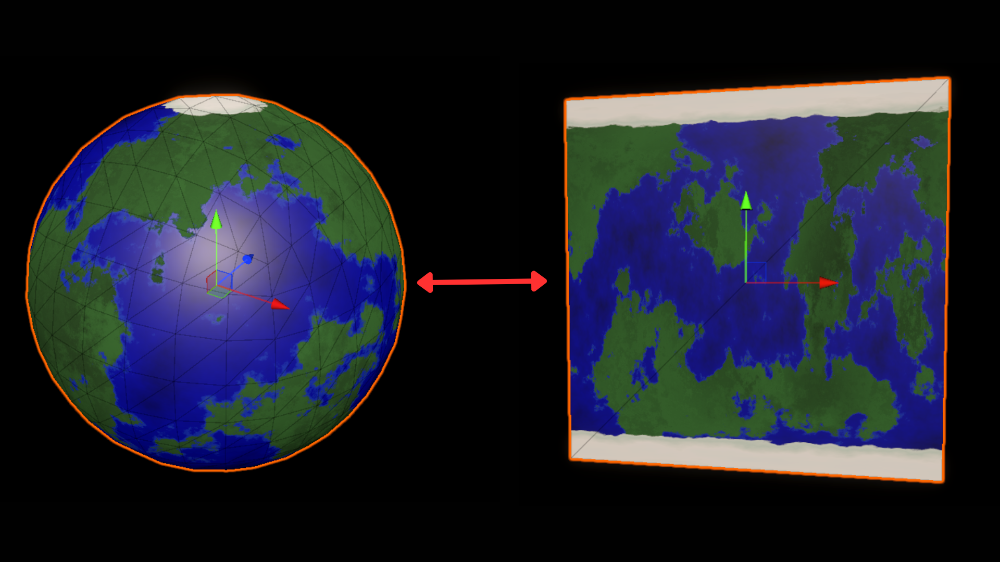

First, in order to bake the texture, we need to be able to convert 2D UV coordinates back into 3D positions on a unit sphere.
With this we can sample our 3D procedural noise functions with 2D UVs and store their outputs on a texture.
The result is what's called **equirectangular projection** (also known as a latitude-longitude projection) - the same projection
used for world maps where the whole globe is unwrapped into a rectangle.

### Understanding the UV-to-Spherical Conversion

We will achieve this conversion with simple trigonometry by isolating the different components of spherical coordinates.
Keep in mind that on a unit sphere, x,y,z coordinates range from -1 to 1 - so we want to convert our UVs into direction
vectors essentially.

For a detailed exploration of spherical coordinates and conversions check out scratchapixel's [article](https://www.scratchapixel.com/lessons/mathematics-physics-for-computer-graphics/geometry/spherical-coordinates-and-trigonometric-functions.html).

Here I'll break down the math behind converting a 2D UV coordinate into a 3D position on a sphere:

#### 1. We take the 2D UV coordinates from the quad. These are in the range [0,1] for both U and V. We convert them to spherical angles phi and theta:

This uses **spherical coordinates**, where any point on a sphere can be described using two angles:
- **Phi (φ)**: The longitude angle, rotating around the vertical (Y) axis. Goes from 0 to 2π (0° to 360°)
- **Theta (θ)**: The latitude angle, measured from the north pole down. Goes from 0 at the top (north pole) to π at the bottom (south pole)

```hlsl
float phi   = uv.x * 2.0 * PI;   // longitude: [0,1] → [0, 2π]
float theta = (1.0-uv.y) * PI;   // latitude: [0,1] → [π, 0] 
```
Note that we actually flip θ through the V coordinate with `(1.0 - uv.y)`. 
We want theta = 0 at the top (north pole), because we use cos(theta) below to map the y coordinate. cos(0) = 1, which 
corresponds to the top of the sphere, or the north pole.

#### 2. Next, we convert these spherical angles into Cartesian coordinates (x,y,z) using:

```hlsl
dir = float3(
    sin(theta) * cos(phi),
    cos(theta),
    sin(theta) * sin(phi)
);
```
So **X = sin(theta) * cos(phi)** means "go **sin(θ)** distance from the Y-axis, in the direction of angle φ around the circle,
specifically the X-component of that direction."

And **Z = sin(theta) * sin(phi)** means "go **sin(θ)** distance from the Y-axis, in the direction of angle φ around the circle,
but in the Z-component of that direction."
   
For the **Y component**, **cos(theta)** represents the height, going from Y=1 at the north pole (theta=0) down to Y=-1 at the south pole (theta=π).

Essentially, `cos(phi)` and `sin(phi)` trace out a circle in the XZ plane (like a clock face viewed from above), and
`sin(theta)` scales that circle's radius based on the latitude.

We can implement this in a custom function node:

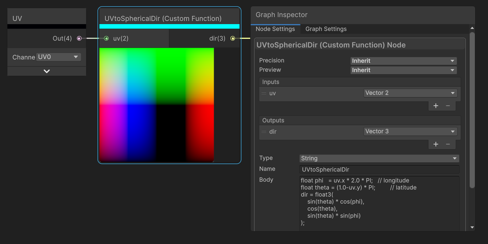

(Note that PI is automatically defined in Shader Graph HLSL code)

And connect to the position input of our continent function:
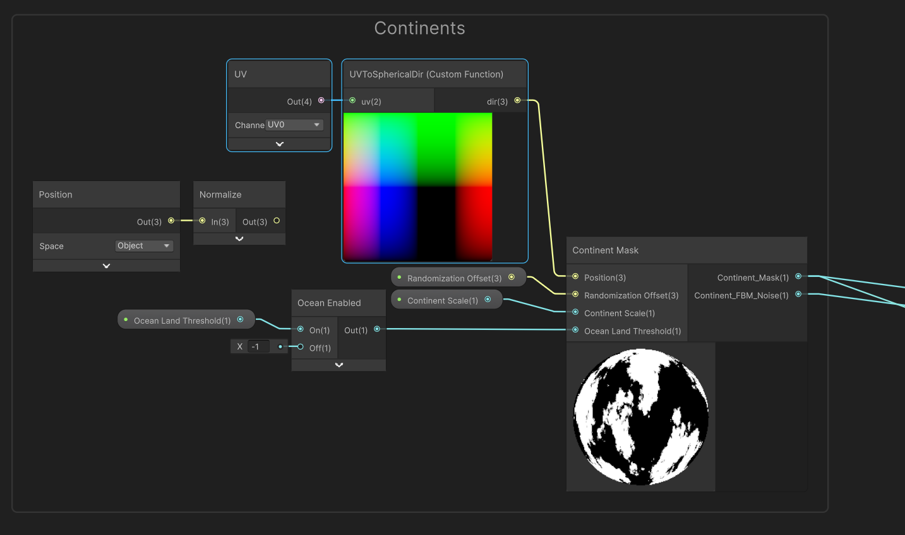

### Adding Baking Mode to the Shader

We don't want to always have UV input on in our shader, so we can to add a boolean keyword that switches between the 
two modes. Add a Boolean Keyword property called "Bake Output" and use it to switch between using Object Position and UV-to-Spherical position:

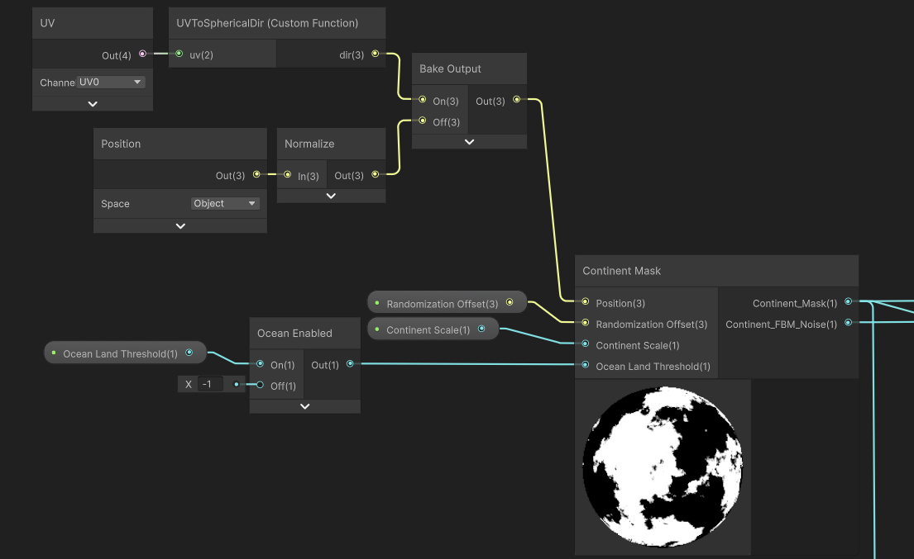

And then for all other terrain layer functions that use the position - oceans, ice caps, surface color:
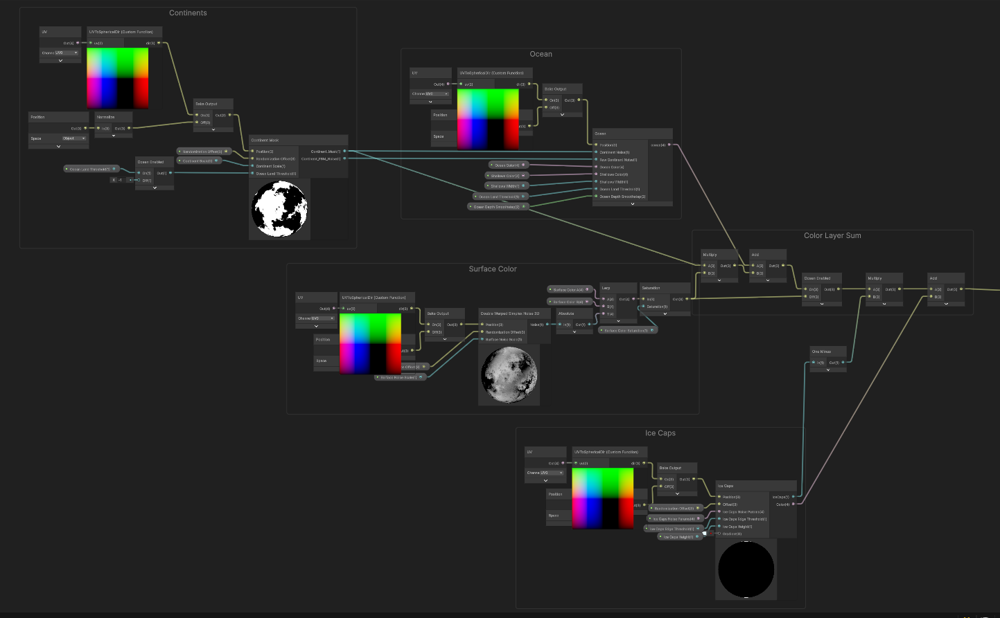

To test that this works correctly, create a quad in the scene, assign the planet material to it, and enable the Bake Output keyword.
You should see the correctly unwrapped planet texture:
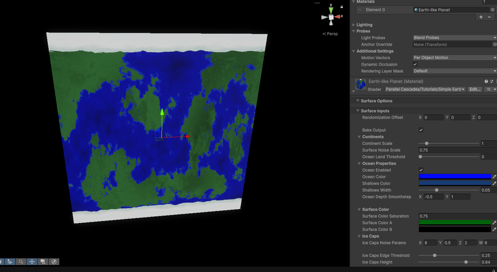

### Emission Output
Finally for our shader, we want to use the Bake Output keyword to switch the shader output to emission - this makes sure we
get the correct color output when baking, without any lighting interference, like we would with an unlit shader:
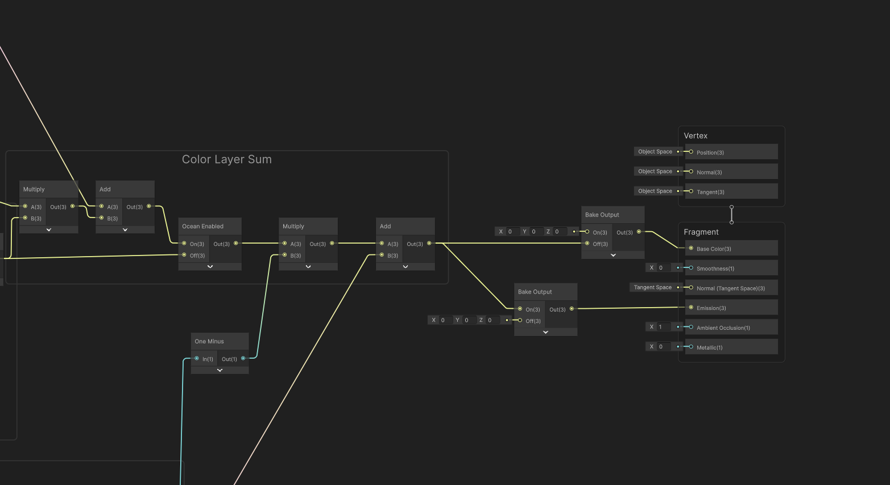

### Setting up the Editor Script

Now that we have the shader set up to bake using UV coordinates, we need to create an Editor script that will render the material to a texture and save it to disk.
We will use Unity's MenuItem attribute to add a context menu option when right-clicking on the material in the Project window.

We create a new C# script called *MaterialTextureBaker.cs*. This will be an editor script, so make sure it is placed in
an *Editor* folder:

```csharp
using UnityEditor;
using UnityEngine;
using UnityEngine.Rendering;

public static class MaterialTextureBaker
{
    private const int k_resolution = 1024; // could be 512, 2048, etc depending on desired texture size

    [MenuItem("CONTEXT/Material/Bake Texture from Material")]
    private static void ContextMenuBakeTexture(MenuCommand context)
    {
        // Fetches the material you right-clicked on
        Material material = (Material)context.context;

        // Opens a save file dialog to select where to save the baked texture
        string savePath = EditorUtility.SaveFilePanelInProject("Save Texture","texture","png","");
        if (string.IsNullOrEmpty(savePath))
        {
            Debug.Log("No path selected!");
            return;
        }

        // Toggle the keyword to enable the correct baking output
        LocalKeyword kw = new LocalKeyword(material.shader, "_BAKE_OUTPUT");
        material.SetKeyword(kw, true);

        var textureToBake = TextureUtilities.GetTextureFromMaterial(material, k_resolution);

        TextureUtilities.SaveTextureAsPNG(savePath, textureToBake);
        
        // Assign default settings to the imported texture
        AssetDatabase.ImportAsset(savePath);
        TextureImporter textureImporter = AssetImporter.GetAtPath(savePath) as TextureImporter;
        if (textureImporter != null)
        {
            textureImporter.maxTextureSize = k_resolution;
            textureImporter.textureCompression = TextureImporterCompression.CompressedHQ;
        }
        AssetDatabase.ImportAsset(savePath, ImportAssetOptions.ForceUpdate);

        // Also need to perform cleanup
        Object.DestroyImmediate(textureToBake);
        AssetDatabase.Refresh();

        // Disable the baking keyword to restore the planet to normal rendering
        material.SetKeyword(kw, false);
    }
}
```

We also need to setup the *TextureUtilities* class:

To actually get a texture from a material, we can set up a temporary orthographic camera and put the material on a quad
primitive mesh (this is just a plane with 4 vertices). We then render the camera to a RenderTexture and read back the pixels into a Texture2D.
We use the quad primitive to actually have something in front of the camera to render, and this hold the material. The render texture
holds the camera output so that we can read from it and save to disk.

We set up the color output of the shader to go to emission during baking mode earlier. In this utility we disable all
other lights in the scene to avoid interference.

The camera is orthographic so that there is no perspective distortion.

```csharp
public static class TextureUtilities
{
  public static Texture2D GetTextureFromMaterial(Material material, int textureSize)
  {
    // Will use render texture to capture camera output later
    RenderTexture renderTexture = RenderTexture.GetTemporary(textureSize, textureSize, 16);
    RenderTexture.active = null;
  
    // Temporary orthographic camera setup
    GameObject tempCameraObj = new GameObject
    {
        transform =
        {
            position = Vector3.back
        },
        hideFlags = HideFlags.HideAndDontSave
    };
  
    Camera tempCamera = tempCameraObj.AddComponent<Camera>();
    tempCamera.hideFlags = HideFlags.HideAndDontSave;
    tempCamera.enabled = false;
    tempCamera.cameraType = CameraType.Preview;
    tempCamera.orthographic = true;
    tempCamera.orthographicSize = 0.5f;
    tempCamera.farClipPlane = 10.0f;
    tempCamera.nearClipPlane = 0.1f;
    tempCamera.clearFlags = CameraClearFlags.Color;
    tempCamera.backgroundColor = Color.clear;
    tempCamera.renderingPath = RenderingPath.Forward;
    tempCamera.useOcclusionCulling = false;
    tempCamera.allowMSAA = false;
    tempCamera.allowHDR = true;
    
    int previewLayer = 31;
    tempCamera.cullingMask = 1 << previewLayer;
  
    tempCamera.targetTexture = renderTexture;
    
    //// Lighting setup
    // Need to disable all scene lights so they don't interfere with the material preview
    // Will re-enable them after rendering
    Light[] sceneLights = Object.FindObjectsByType<Light>(FindObjectsSortMode.None);
  
    foreach (var light in sceneLights)
    {
        light.enabled = false;
    }
    
    // Render the material on a temporary quad directly in front of the camera
    var tempQuad = GameObject.CreatePrimitive(PrimitiveType.Quad);
    tempQuad.GetComponent<MeshRenderer>().sharedMaterial = material;
    tempQuad.layer = previewLayer;
    tempCamera.Render();
  
    // Use a render texture to capture the camera output
    RenderTexture.active = renderTexture;
    Texture2D texture = new Texture2D(textureSize, textureSize, TextureFormat.ARGB32, false);
    texture.ReadPixels(new Rect(0, 0, renderTexture.width, renderTexture.height), 0, 0);
    texture.Apply();
    
    // Cleanup
    RenderTexture.active = null;
    RenderTexture.ReleaseTemporary(renderTexture);
    
    Object.DestroyImmediate(tempCameraObj);
    Object.DestroyImmediate(tempQuad);
    
    // Restore disabled scene lights
    foreach (var light in sceneLights)
    {
        light.enabled = true;
    }
  
    return texture;
  }
}
```

In the same static **TextureUtilities** class we want to add a simple method for saving a texture as a PNG:
```csharp
public static bool SaveTextureAsPNG( string savePath, Texture2D tex)
{
    tex.Apply();
    byte[] data = tex.EncodeToPNG();

    if (data != null)
    {
        System.IO.File.WriteAllBytes(savePath, data);
        return true;
    }
    else
    {
        return false;
    }
}
```

With this we will have a new context menu item by right-clicking on the material and selecting "Bake Texture from Material":
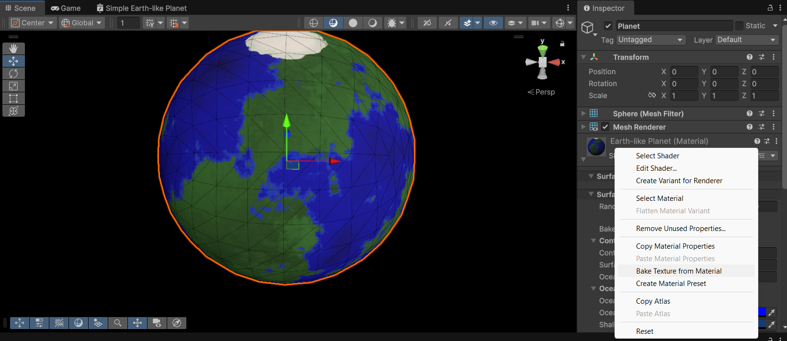

We can bake the texture and see that it looks like the quad output we saw earlier.

### Sampling a baked texture in the shader

Now that we have a baked texture, we can modify our shader to sample from it instead of running the noise functions. We 
need to perform the opposite transformation of our earlier cartesian to spherical transformation: We have a 2D texture to sample from,
but we have a 3D sphere with object positions to sample with. So we need a conversion from 3D position to UV coordinates:

```hlsl
void spherePositionToUV(float3 position, out float2 uv)
{
    // sphericalCoord.x is azimuth in [-PI, PI], sphericalCoord.y is elevation in [0, PI]
    float2 sphericalCoord = float2(atan2(position.z, position.x), acos(position.y));
    
    // UVs need to be in [0,1] range
    float u = frac((sphericalCoord.x + PI) / (2.0 * PI) + 0.5f); // add 0.5 to rotate x to sync 3D position with baked texture orientation
    float v = 1.0 - (sphericalCoord.y / PI);
    
    uv = float2(u, v);
}
```

We can also set this up in a custom function node and connect it to a Sample Texture 2D node to get the color from the baked texture.
Let's also add another boolean keyword "Static Texture Enabled" to allow us to quickly switch between procedural and baked texture modes, to compare 
performance and visuals:

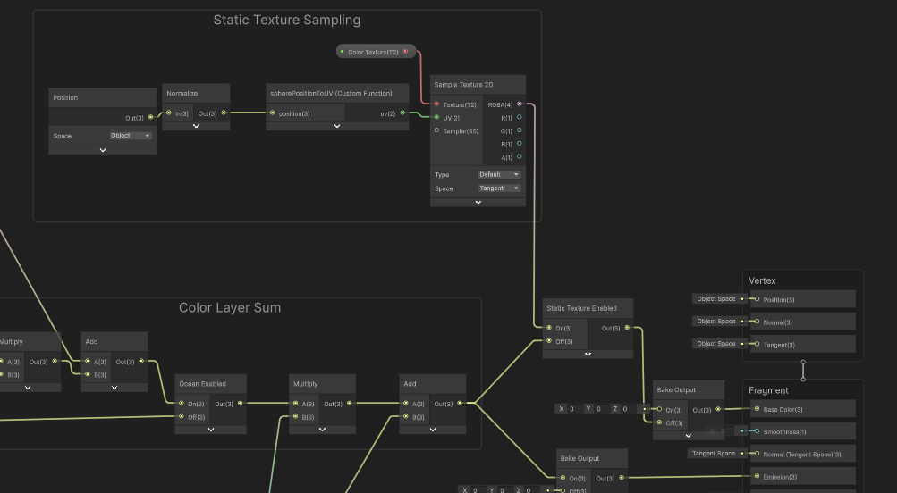

And so we can switch between baked and procedural mode on our planet. Let's compare the performance:
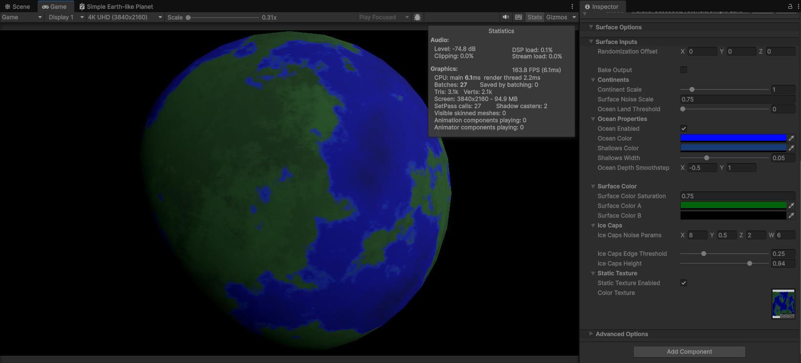
We can see we've doubled our framerate to 160 FPS/6 ms rendering time.

### Blurry Textures

We can adjust the resolution of the baked texture to get more detail, in case the 1024x1024 texture is too blurry. But
be wary of going too high and using too much memory for your textures. The baking time goes up quadratically with 
resolution as well.

## Fixing Seam
There seems to be an issue with a seam appearing on the texture where the UVs wrap around from 1 back to 0.
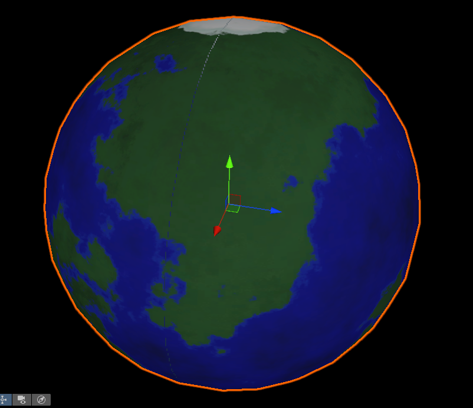

This is actually a common problem with sampling equirectangular textures and its solution is straightforward and
documented in the shader graph manual: https://docs.unity3d.com/Packages/com.unity.shadergraph@17.4/manual/Sample-Texture-2D-Node.html#example-graph-usage

We need to set the Mip Sampling Mode on our Sample Texture 2D node to Gradient:
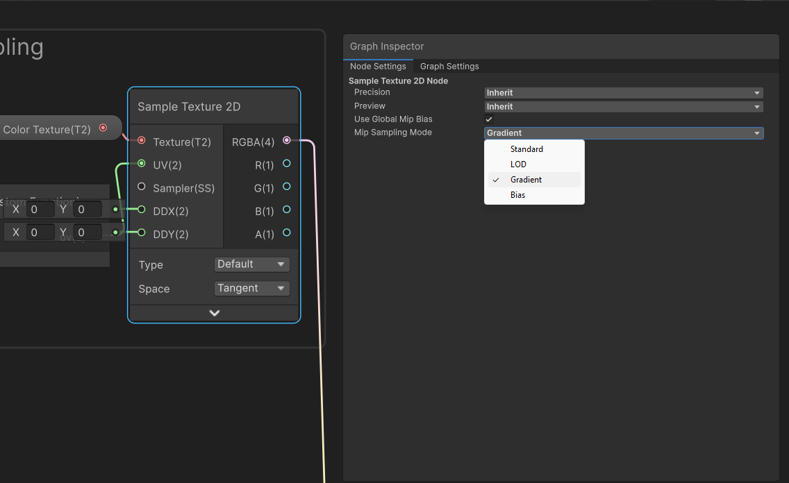

And connect our normalized position to the DDX and DDY inputs via DDX and DDY nodes:
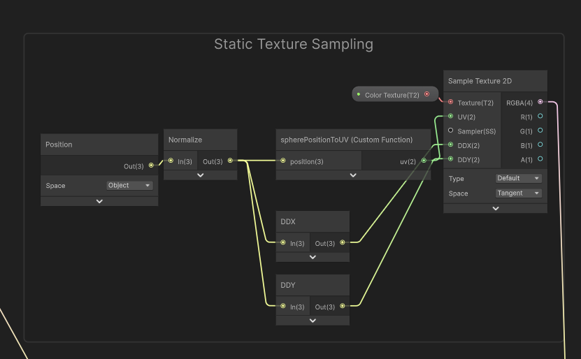

This fixes the seam problem and completes this part of the tutorial!

You can get the completed project from the GitHub repo:
github.com/Parallel-Cascades/planet-texture-baking

# Conclusion
I've shown you one simple method to bake procedural planet textures inside the Unity Editor using a custom script. But there
are still ways to improve this.

One problem that is very noticeable is the distortion at the poles of the planet, which is a common issue with equirectangular projections.
You will have noticed how the poles are stretched out on the baked texture. They take up a lot more pixel area than
they actually represent on the planet surface.

In practice, this makes the poles appear more clear and high-res compared to the rest of the planet, and consequently
the equatorial areas look blurrier.

In the next tutorial, I will show you a method to bake textures using a cubemap projection instead, which addresses this issue:
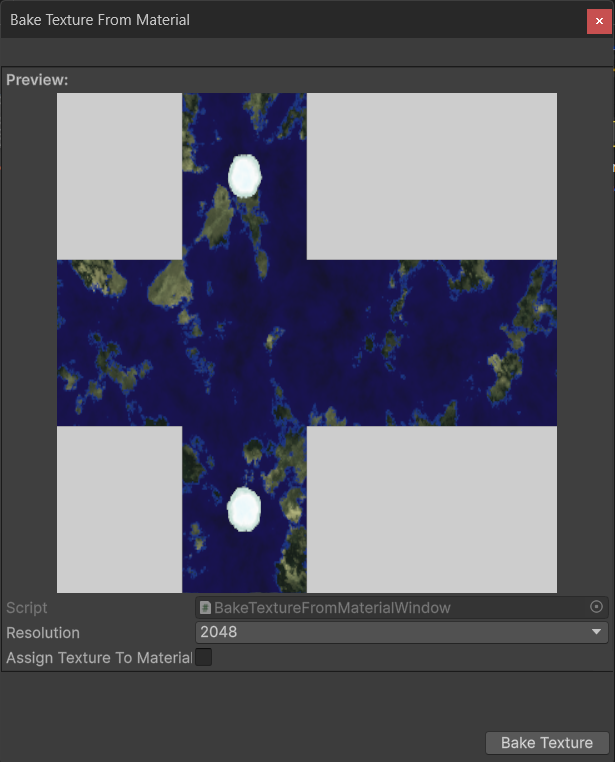

If you'd like to practice with more complex planet shaders, the [Procedural Planet Generation Lite Samples](https://assetstore.unity.com/packages/vfx/shaders/procedural-planet-generation-lite-sample-pack-296362) asset is **free**
on the Unity Asset Store and contains moons, more advanced Earth-like planets, gas giants and stars.

If this tutorial was useful to you, and you would like to see more like it, consider supporting me on [Ko-fi](https://ko-fi.com/parallelcascades)
